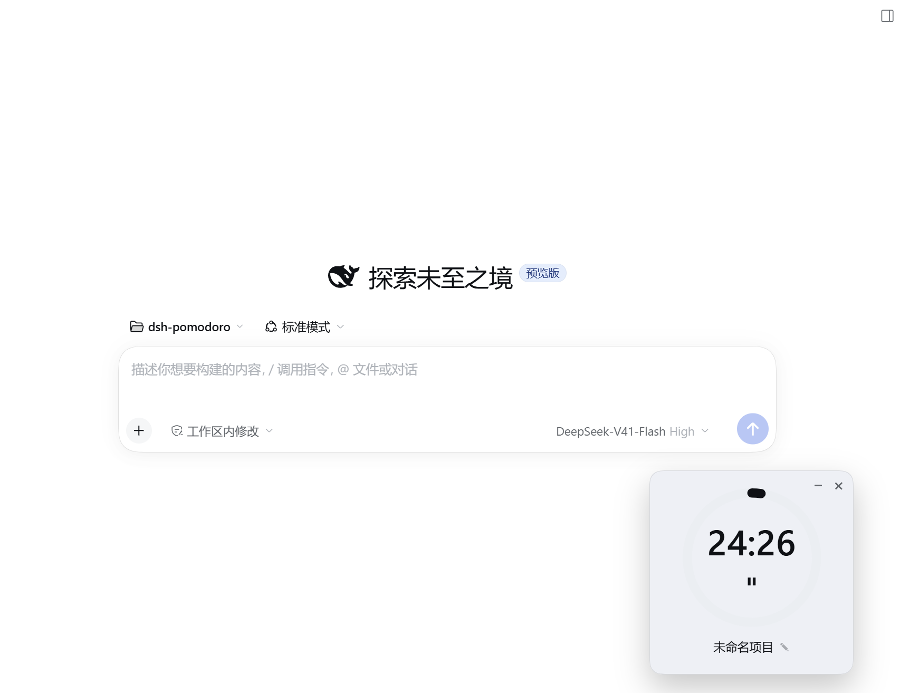
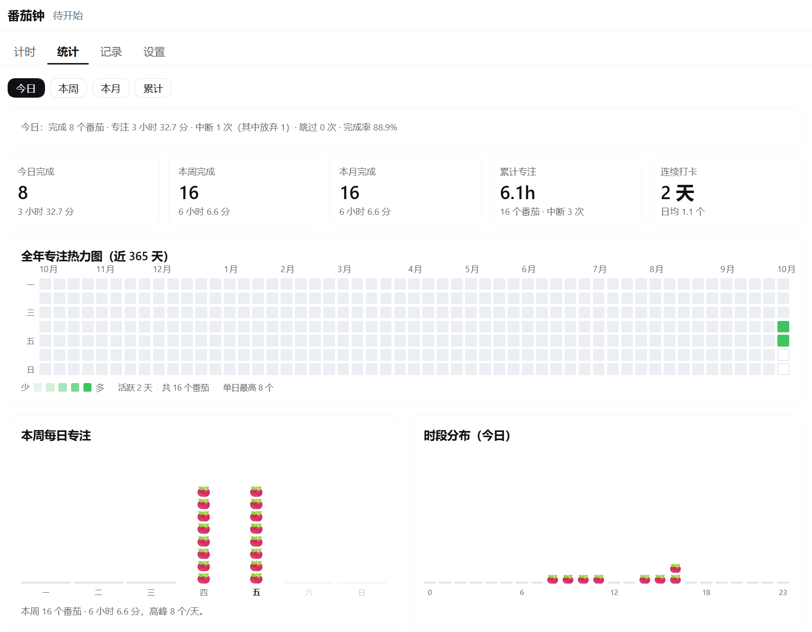
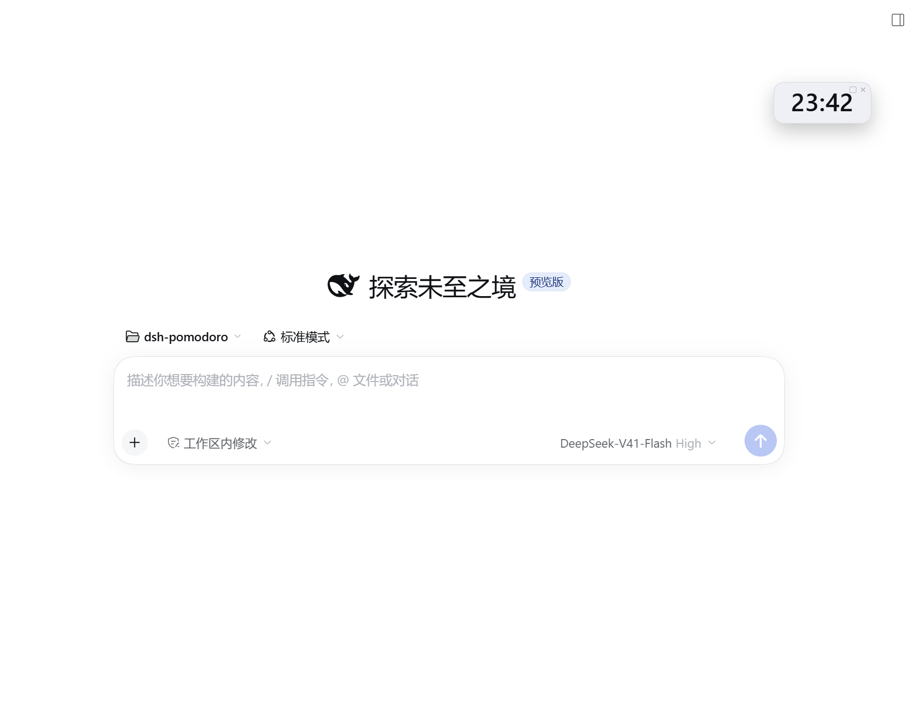

# 🍅 dsh-pomodoro

DeepSeek Harness（DSH）番茄钟插件：经典 25/5/15 计时，可关联当前会话任务或手动输入项目名，自带统计面板与全年热力图，数据本地持久化并支持导出 CSV（Excel 双击可直接打开）。

> **非官方第三方插件**，独立于 DeepSeek / DSH 官方。插件问题请开在本仓库，不要报到 DSH 官方。

## 界面预览

| 计时面板 | 统计面板 | 角落迷你药丸 |
| :---: | :---: | :---: |
|  |  |  |

## 功能

- **经典番茄钟**：专注 25 / 短休息 5 / 长休息 15 分钟，时长与"每几个番茄进长休息"都可改。倒计时按截止时间戳走，后台节流回前台自动校正，不漂移。
- **关联任务**：打开某会话后，面板自动解析其工作区名 / 会话标题作为一键候选；也可从最近项目挑、或手输任意项目名。
- **三处入口**：侧边栏番茄图标 → 整屏面板（计时 / 统计 / 记录 / 设置四页）；一个可拖动的悬浮计时卡；角落一个只显示跳动时间的迷你药丸。
- **全年热力图**：仿 GitHub 贡献图，覆盖近 365 天，跟随深浅主题；配今日 / 本周 / 本月 / 累计四口径与连续打卡。
- **完成卡片**：专注结束自动开始休息并弹卡；休息结束弹卡但默认不自动开下一个专注。
- **可信的中断记账**：完成 / 中断 / 放弃 / 跳过分开统计，中断不计入完成数，所以完成率是可信的；中断还能"继续"、最终仍算一个完成。
- **本地 + 可导出**：数据存本机一份全局 JSON，原子写入、损坏留档；可导出带 BOM 的 CSV，Excel 直接打开中文不乱码。
- **零运行时依赖**：不引入 xlsx 等库，整包复制即可用。

## 前置条件

这是 DSH 的插件，不是独立应用。装它之前你需要：

1. **已安装 DSH 并至少成功运行过一次**（插件往 DSH 的 profile 里注册，DSH 没跑过就没有可写入的 profile）。
2. **Node.js `^22` 或 `>=24`**（跑测试 / 安装脚本的 JSON 处理用）。
3. Windows 用自带的 `pwsh`；macOS / Linux 用 `bash` + `node`。

## 安装

npm 包名 `@yongfanbeta/dsh-pomodoro`（插件 id / bundle 行名 / npm 名三者必须一致）。

**方式 A · 官方 CLI（推荐）**

```powershell
dsh plugin --profile web add @yongfanbeta/dsh-pomodoro
dsh web   # 或重启桌面端 profile
```

**方式 B · 从源码装**

```powershell
# Windows
pwsh -File scripts/install.ps1
```

```bash
# macOS / Linux
bash scripts/install.sh
```

脚本会自动定位**正在运行的 profile**、把插件复制进 `node_modules`、登记 bundle 与 dependency。重启 DSH 后左侧栏出现 🍅 即生效。

> ⚠️ **装错 profile 是"装了却看不见"的头号原因**：只有正在运行的那个 profile 会加载插件。请在 DSH 会话内跑脚本，或先确认 `$env:DSH_PROFILE`；装完用 `npm run check:install` 复核（它会打印实际校验的 profile 名）。

卸载：`dsh plugin --profile web remove @yongfanbeta/dsh-pomodoro`，或 `pwsh -File scripts/install.ps1 -Uninstall` / `bash scripts/install.sh --uninstall`。数据文件会保留。

## 使用

1. 重启 DSH，点左侧栏番茄图标进入面板「计时」页。
2. 要关联当前任务就先打开对应会话、回到面板点候选项；或直接手输项目名。
3. 点「开始专注」。到点自动记录并切到休息。
4. 「统计」页看热力图与汇总，「记录」页导出 CSV。
5. 悬浮计时卡和角落药丸都能就地开始 / 暂停 / 停止。

## 数据与隐私

数据**全部存在本机**：`${DSH_HOME:-~/.dsh}/storages/pomodoro/state.json`。无遥测、无统计上报、不联网、不上传任何数据。导出 CSV 也在本地完成。

## 已知限制

- 提示音依赖浏览器 `AudioContext`（需先与页面交互过）；系统通知需授权，未授权时静默跳过。
- 会话标题来自 host 的 `sessionTitle` 服务；不可用时退化为工作区名 / 目录名。
- 数据为全局一份，不按工作区隔离（已确认的取舍）。
- 导出为 CSV（非多工作表 `.xlsx`）。

## 更多

- 想看**设计与实现细节**（进程边界、中断记账、挂载点、自检脚本、npm 发布流程、二次开发），见 [CONTRIBUTING.md](CONTRIBUTING.md)。
- 想读**这次是怎么"用嘴"做出来的**，见 [一行代码不写-复现DSH番茄钟.md](一行代码不写-复现DSH番茄钟.md)。
- 版本变更见 [CHANGELOG.md](CHANGELOG.md)。

## 许可证

[MIT](LICENSE)
